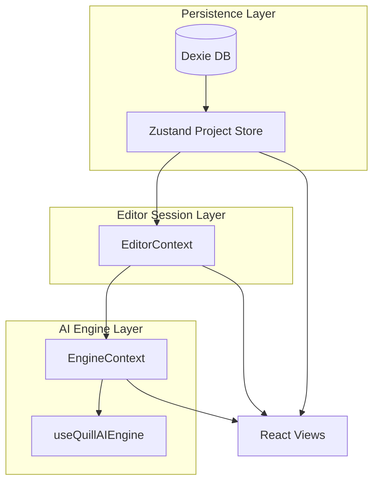

# Quill AI Architecture

## 1. State Hierarchy

Quill AI separates state into three main layers to keep persistence, editor behavior, and AI processing concerns loosely coupled.

### 1.1 Project Store (Zustand)

- **Location:** `features/project/store/useProjectStore.ts`
- **Responsibility:** Long‑lived, project-level data.
- **Persists to:** `Dexie` via `services/db.ts`.

Stored entities:

- **Projects:** metadata, setting, `manuscriptIndex`, `lore`, timestamps.
- **Chapters:** title, `content`, `lastAnalysis`, chapter ordering.

Key APIs:

- **Project lifecycle:** `init`, `createProject`, `importProject`, `loadProject`.
- **Chapters:** `createChapter`, `selectChapter`, `reorderChapters`, `updateChapterContent`, `updateChapterTitle`, `deleteChapter`, `getActiveChapter`.
- **Analysis & lore:** `updateChapterAnalysis`, `updateProjectLore`, `updateManuscriptIndex`.

The store is the **single source of truth** for persisted manuscript structure and connects directly to Dexie.

### 1.2 Editor Context (React Context)

- **Location:** `features/shared/context/EditorContext.tsx`
- **Responsibility:** Transient editing session state for the active chapter.

Key capabilities:

- **Editor instance:** Holds the Tiptap `Editor` and `setEditor`.
- **Text & history:** `currentText`, `updateText`, `commit`, `undo`, `redo`, `restore`, `hasUnsavedChanges` via `useDocumentHistory`.
- **Selection & cursor:** `selectionRange`, `selectionPos`, `cursorPosition`, `setSelection`, `setSelectionState`, `clearSelection` via `useEditorSelection`.
- **Navigation:** `activeHighlight`, `handleNavigateToIssue`, `scrollToPosition`, `getEditorContext` (for deep linking from analysis/agent back into the document).
- **Branching:** Multiverse branches (`branches`, `activeBranchId`, `isOnMain`, `createBranch`, `switchBranch`, `mergeBranch`, `deleteBranch`, `renameBranch`) via `useEditorBranching`.
- **Inline comments:** Critique comments (`inlineComments`, `visibleComments`, `setInlineComments`, `dismissComment`, `clearComments`) via `useEditorComments`.
- **Zen Mode:** `isZenMode`, `toggleZenMode` for focused writing UI.

The EditorContext **subscribes to** the Project Store (active chapter) and exposes a rich session API to the UI and Engine.

### 1.3 Engine Context (AI Engine)

- **Location:** `features/shared/context/EngineContext.tsx`
- **Responsibility:** Orchestrates AI features (analysis, magic editor, agent tools) and background indexing.

Composition:

- Reads from **EditorContext**: `currentText`, `commit`, `selectionRange`, `clearSelection`.
- Reads from **Project Store**: `currentProject`, `activeChapterId`, `updateChapterAnalysis`, `updateProjectLore`.
- Wraps **`useQuillAIEngine`** from `features/shared/hooks/useDraftSmithEngine.ts` for core AI logic.
- Runs **`useManuscriptIndexer`** to build and update contradiction data (`contradictions: Contradiction[]`).

Exports:

- **State:** `isAnalyzing`, `analysisError`, `analysisWarning`, magic editor state, and `pendingDiff`.
- **Actions:** `runAnalysis`, `cancelAnalysis`, magic editor actions, `handleAgentAction`, `acceptDiff`, `rejectDiff`.

The EngineContext is the **single integration point** where editor text + project metadata feed into AI services.

---

## 2. Data Persistence & Debounce Strategy

### 2.1 Dexie Schema

- **Location:** `services/db.ts`
- Dexie database `QuillAIDB` with tables:
  - `projects`: `id, updatedAt`
  - `chapters`: `id, projectId, order, updatedAt`
  - `memories`: agent memory notes (facts, issues, preferences) with compound index `[scope+projectId]` and multi-entry `topicTags`
  - `goals`: agent goals per project with compound index `[projectId+status]`
  - `watchedEntities`: entities the agent proactively monitors per project

The Project Store uses `projects` and `chapters` for manuscript persistence. The agent memory system (`services/memory`) uses `memories`, `goals`, and `watchedEntities` to provide long‑lived context for the omniscient agent.

### 2.2 `scheduleChapterPersist` Debounced Writes

- **Location:** `features/project/store/useProjectStore.ts`
- Purpose: Avoid hammering IndexedDB while typing, but still keep the DB reasonably fresh.

Algorithm (per chapter):

- In‑memory maps:
  - `pendingChapterWrites: Map<chapterId, { timer, promise, resolve }>`
  - `latestChapterContent: Map<chapterId, { content, updatedAt }>`
- When `updateChapterContent(chapterId, content)` is called:
  - Update local state immediately (optimistic UI).
  - Call `scheduleChapterPersist(chapterId, { content, updatedAt })`.
- `scheduleChapterPersist`:
  - Stores the latest payload in `latestChapterContent`.
  - Clears any existing debounce timer for this chapter.
  - Ensures there is a shared `promise` per chapter that resolves after the debounced write completes.
  - Sets a `setTimeout` for `WRITE_DEBOUNCE_MS` (400 ms):
    - On fire, reads the **latest** content for that chapter.
    - Writes `content` and `updatedAt` to `db.chapters`.
    - Also updates `db.projects.updatedAt` for the current project.
    - Cleans up maps and resolves the stored promise.

Benefits:

- **Write coalescing:** Rapid edits to the same chapter result in **one** DB write after idle.
- **Per‑chapter isolation:** Debounce is keyed by `chapterId`, so switching chapters does not block others.
- **Awaitable:** Callers can `await updateChapterContent` to wait until the debounced persist has finished (useful in workflows/tests).

---

## 3. AI Pipeline

The AI analysis pipeline flows from UI interactions down to Gemini and back into persisted analysis.

### 3.1 High‑Level Flow

1. **User action** (e.g., "Run Analysis" button) calls `EngineContext.actions.runAnalysis`.
2. `EngineContext` delegates to `useQuillAIEngine.runAnalysis`.
3. `useQuillAIEngine`:
   - Pulls fresh text from `getCurrentText` and chapter metadata from the Project Store.
   - Uses an `AbortController` to cancel any in‑flight analysis if a new one starts.
   - Calls `analyzeDraft(text, projectSetting, manuscriptIndex, signal)` from `services/gemini/analysis`.
4. **Token Guard / Text Prep:**
   - `analyzeDraft` calls `prepareAnalysisText(text)` from `services/gemini/tokenGuard.ts`.
   - This enforces `ApiDefaults.maxAnalysisLength` and, if necessary, truncates at a clean boundary, returning an optional warning string.
5. **Gemini API Call:**
   - `analyzeDraft` builds a structured prompt (including setting + index context) and calls `ai.models.generateContent` on the shared Gemini client from `services/gemini/client.ts`.
   - Model selection and token budgets are derived from `config/models.ts` (`ModelConfig`, `ThinkingBudgets`).
6. **Resilient Parsing:**
   - The raw response is parsed into a strongly typed `AnalysisResult` via a resilient parser (handles partial/malformed JSON, missing fields, etc.).
7. **Results & Persistence:**
   - `useQuillAIEngine`:
     - Tracks usage via `useUsage().trackUsage`.
     - Sets `analysisWarning` if the token guard truncated input.
     - Verifies that the active chapter hasn’t changed during the async call (chapter guard).
     - Calls `updateChapterAnalysis(chapterId, result)` in the Project Store.
     - Derives `Lore` from `settingAnalysis` issues and persists via `updateProjectLore(projectId, lore)`.

### 3.2 Token Guard Pattern

- **Location:** `services/gemini/tokenGuard.ts`, `config/models.ts`, `config/api.ts`.
- Responsibilities:
  - `checkTokenLimit(text, model, reserveTokens)` estimates token usage against `TokenLimits`.
  - `truncateToLimit` ensures text fits by trimming at paragraph/sentence boundaries.
  - `prepareAnalysisText` applies `ApiDefaults.maxAnalysisLength` for analysis requests and returns a user‑facing warning.

This pattern ensures:

- Requests remain within model context windows.
- Large manuscripts degrade gracefully (truncation + explicit warning) instead of throwing opaque 4xx/5xx errors.

---

## 4. UI & Safety Patterns

### 4.1 Viewport Collision for Overlays

- **Usage:** Inline critique comments and floating UI (e.g., comment cards near text selections).
- **Pattern:** A dedicated viewport‑collision hook calculates the optimal placement of overlays relative to the selection rectangle and viewport bounds.
- **Behavior:**
  - Detects when a card would overflow the screen.
  - Flips / shifts placement (above vs. below, left vs. right) to keep content visible.
  - Often integrated with motion/opacity transitions for smooth UX.

This keeps inline tools usable even near viewport edges and on smaller screens.

### 4.2 Token Guard for API Safety

Beyond the analysis pipeline, the **Token Guard** pattern is the general safeguard for all Gemini requests that operate on large text inputs:

- Centralizes model limits and budgets in `config/models.ts`.
- Uses `ApiDefaults` to approximate tokens and enforce safe character limits.
- Returns structured diagnostics (`TokenCheckResult`) that UI/engine code can surface as warnings rather than letting calls fail unexpectedly.

Together, the **Viewport Collision** UX pattern and the **Token Guard** API pattern make the system resilient both in the UI (no off‑screen overlays) and in backend calls (no context overflow).

---

## 5. Omniscient Agent Layer (AppBrain + `useAgentOrchestrator`)

Above the Engine layer, Quill AI exposes an omniscient agent that sees unified application state and can safely execute tools.

- **State aggregation:** `AppBrainProvider` (`features/shared/context/AppBrainContext.tsx`) combines:
  - Project Store (projects, chapters, lore, manuscript index)
  - EditorContext (text, selection, branches, comments, zen mode)
  - Analysis state (incremental analysis results and status)
  - Deterministic intelligence (HUD, entities, timeline, style, heatmap)
  - UI/session state (cursor, active view/panel, chat session metadata)
- **Context building:** `services/appBrain/contextBuilder.ts` derives AI‑ready context strings (full, compressed, navigation‑focused, editing‑focused) from `AppBrainState`.
- **Canonical agent hook:** `useAgentOrchestrator` (`features/agent/hooks/useAgentOrchestrator.ts`) is the primary entrypoint for chat/agent UIs. It:
  - Creates Gemini chat sessions via `services/gemini/agent.ts` with `ALL_AGENT_TOOLS`.
  - Builds prompts from AppBrain context (including compressed variants for latency‑sensitive modes).
  - Routes tool calls through `executeAppBrainToolCall` to `AppBrainActions` (navigation, editing, analysis, UI, knowledge, generation).

### 5.1 Legacy Agent Paths (Deprecated)

For backward compatibility, some legacy flows still exist but should be considered deprecated:

- **`useAgentService`** (`features/agent/hooks/useAgentService.ts`)
  - Manually assembles context (fullText, lore, chapters, analysis, intelligenceHUD) and passes it into `AgentController`.
  - New features should prefer `useAgentOrchestrator` instead of extending this path.
- **`ChatInterface`** (`features/agent/components/ChatInterface.tsx`)
  - Legacy chat UI that talks to `QuillAgent` through `useAgentService` and an `onAgentAction` callback.
  - Future UIs should be built on top of `useAgentOrchestrator` + AppBrain, with tool execution flowing through the unified AppBrain actions layer.

Over time, these legacy paths will be migrated or removed as all agent features converge on the AppBrain‑powered omniscient architecture.
